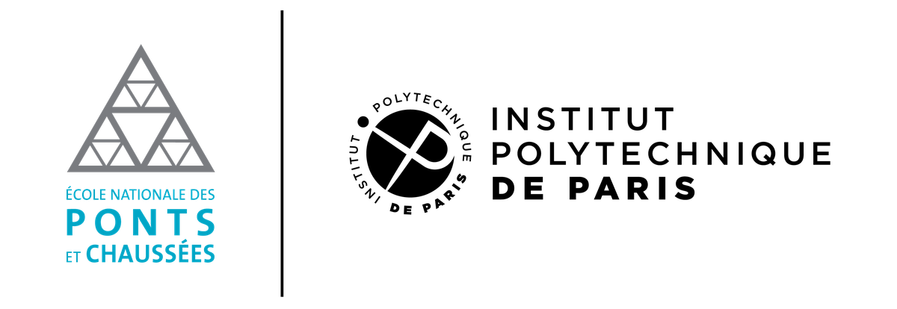

# ◈ Anwar Kardid ◈

### `Software & Quant developer` · `MEng in Applied Maths & CS | Polytechnic Institute of Paris`

<a href="https://www.ecoledesponts.fr/">
  <picture>
    <source media="(prefers-color-scheme: dark)" srcset="assets/enpc-ipparis-dark.png">
    <source media="(prefers-color-scheme: light)" srcset="assets/enpc-ipparis-light.png">
    
  </picture>
</a>

  
  
  

---

## ◈ Profile

Applied mathematician turned product engineer. I work at the intersection of **quantitative modelling** and **shipped software** — the same week can involve an implied-volatility surface and a Next.js release to production.

| | |
| :--- | :--- |
| **Now** | Software Engineer @ **Marianne Education** — building an AI-native SaaS platform |
| **Studying** | MEng Applied Mathematics & CS, **École des Ponts (IP Paris)** — GPA 3.92/4.0, top 10% of cohort |
| **Working on** | LLM & RAG pipelines, retrieval infrastructure, internal automation tooling, full-stack features |
| **Quant side** | Stochastic calculus (Itô/Girsanov), derivatives pricing, portfolio & convex optimisation |
| **Open to** | Quant Research / ML & Software Engineering roles — **Summer 2027** · Paris, London, NYC |

---

## ◈ Technical Stack

| Category | Tools & Frameworks |
| :--- | :--- |
| **Languages** |     |
| **Web & Product** |     |
| **AI & LLM** |    `RAG` `Agents` `Mistral` `Ollama` |
| **Data & ML** |     `XGBoost` |
| **Quant Toolkit** | `Stochastic Calculus` `Itô / Girsanov` `Black–Scholes & Greeks` `Monte Carlo` `Implied Vol Surfaces` `Convex Optimisation` `Time Series` |
| **Infra & Deploy** |       |

---

## ◈ Selected Work

| Project | What it does | Impact | Stack |
| :--- | :--- | :--- | :--- |
| **[Black–Scholes Pricing Platform](INSERT_REPO_URL)** | Closed-form European option pricing with full Greeks, validated against Monte Carlo; implied-vol surfaces across strike/maturity grids | **99%** test coverage · skew & term-structure analysis | `Python` `NumPy` `SciPy` `Plotly` `pytest` |
| **[Credit Card Fraud Detection](INSERT_REPO_URL)** | Statistical learning on a heavily imbalanced transaction set, with a live precision–recall trade-off dashboard | **AUC-ROC 0.98** on **284k** transactions | `XGBoost` `SMOTE` `scikit-learn` `Streamlit` |
| **[Hackathon Judge Infrastructure](INSERT_REPO_URL)** | Evaluation & scoring backend for a national-level OR hackathon at Califrais | **100%** uptime · **27k+** submissions · **150+** competitors | `Linux` `SQL` `Python` |

---

## ◈ By the Numbers

| Metric | Result |
| :---: | :--- |
| **8 / 2,600** | National rank, CNC — Morocco's most competitive engineering entrance exam |
| **Top 10%** | Cohort ranking at École des Ponts (GPA 3.92/4.0) |
| **27,000+** | Submissions served at 100% uptime during a 6-hour live Hackathon - Organizer |
| **ICPC** | National Team — Honorable Mention (2022) |
| **Meta Hacker Cup** | Qualifier (2022) |

---

## ◈ GitHub Stats

<!-- ─────────────  PASTE YOUR STAT CARDS BELOW  ─────────────
     Replace `anwarden` with your handle if it ever changes.
     Recommended themes: nord · tokyonight · nature · transparent
──────────────────────────────────────────────────────────── -->
 

<!-- ── OPTIONAL EXTRAS — uncomment to enable ──

-->

---

> *"The most important questions of life are, for the most part, really only problems of probability."*
> — **Pierre-Simon Laplace**

📍 Paris, France · 📬 <a href="mailto:anwar.kardid@eleves.enpc.fr">anwar.kardid@eleves.enpc.fr</a>

